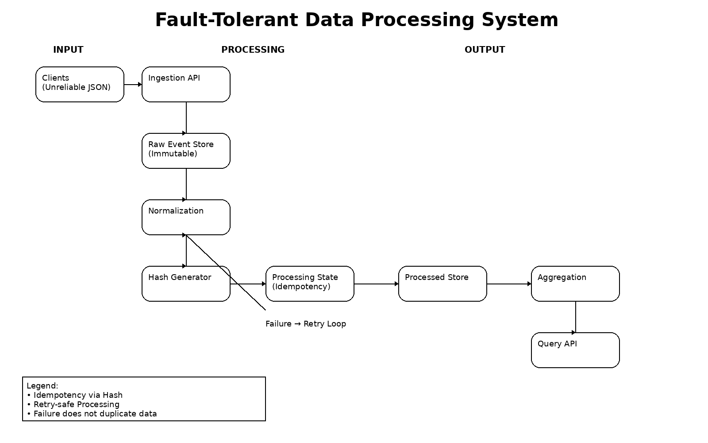

# Fault-Tolerant Data Processing System

## System Architecture Diagram

---

## What assumptions did you make?

- Clients do not provide reliable unique event IDs  
- Event schemas are inconsistent and may change without notice  
- Fields may be missing or malformed  
- Clients may retry requests multiple times (at-least-once delivery)  
- System prioritizes resilience and correctness over strict validation  
- Single-node setup (SQLite) is sufficient for this prototype  

---

## How does your system prevent double counting?

The system uses a deterministic hash-based idempotency mechanism:

- Each event is normalized into a canonical format  
- A SHA-256 hash is generated using stable fields:
  - client_id, metric, amount, timestamp  
- This hash acts as a unique idempotency key  

Before processing:
- If the same hash already exists with status "processed" → event is ignored  

This ensures:
- No duplicate processing  
- Safe retries  
- Exactly-once behavior on top of unreliable input  

---

## What happens if the database fails mid-request?

The system is retry-safe:

- Processing state is recorded before final write  
- If failure occurs:
  - Event is marked as "failed"  

On retry:
- Same event → same hash  
- System retries safely  

Guarantees:
- No data loss  
- No duplicate data  
- Consistent state  

---

## What would break first at scale?

1. SQLite limitations (concurrency issues)  
2. Synchronous processing bottleneck  
3. Unique constraint contention on hash  
4. Aggregation performance without indexing  

---

